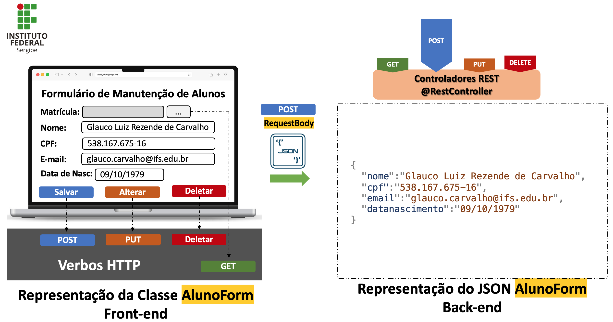
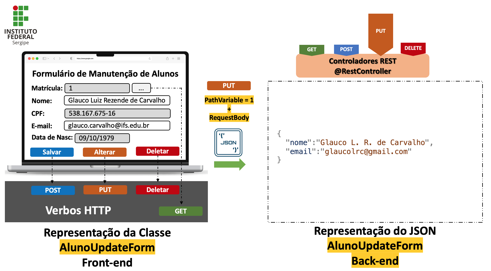

<h1 align="left"> Construindo uma API REST usando Java e Spring Boot </h1>

Este é um exemplo de código-fonte de uma API REST desenvolvida usando a linguagem de programação Java e o framework Spring. Nele, podemos encontrar tópicos essenciais para o sucesso do nosso aprendizado, tais como:
- Implementando e Customizando Repositórios de Dados;
- Usando o Padrão de Projeto DTO <i>(Data Transfer Object)</i>;
- Implementando uma Camada Completa de Segurança;
- Criando e Mapeamento de Entidades;
- Desenvolvendo Controladores REST;
- Utilizando Injeção de Dependência.

>Neste exemplo vamos criar um passo a passo, com alguns detalhes, de como desenvolver uma API REST usando Java e Spring Boot.

>Exemplos de requisições HTTP do Front-end para o Back-end.
- Requisição do tipo <b>POST</b>;

- Requisição do tipo <b>PUT</b>;

- Requisição do tipo <b>DELETE</b>;

- Requisição do tipo <b>GET</b>;

